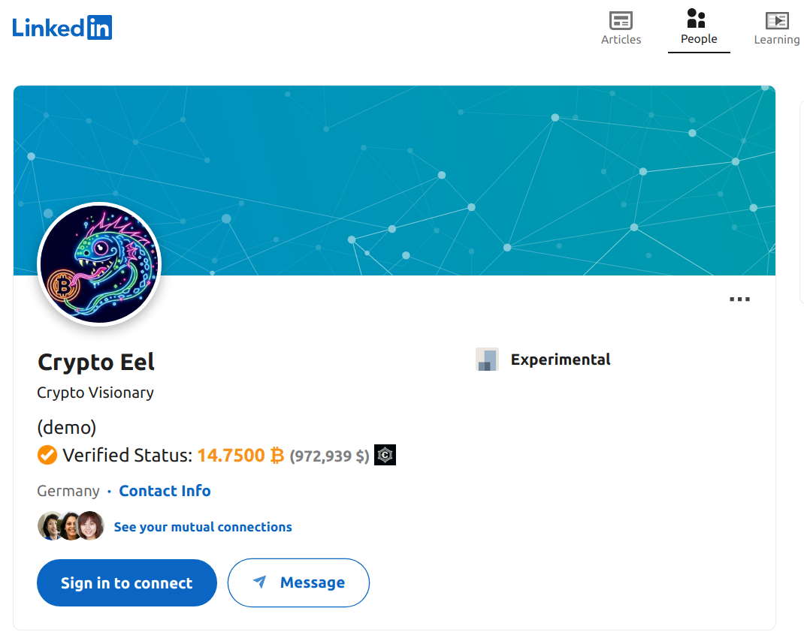

# Hi(gh) Coiny - LinkedIn Chrome Extension

- A chrome extension to shows the Crypto Wealth of LinkedIn Users

## Problem Statement

- To provide more trust and the ability to detect spamming.

## What for?

### When checking a company profile
- Check the financial credits of a company/startup before an employee joins.
- Check the credibility of an institutional investor.
- ...

### When checking a personal profile
- Check the financial stability of a co-founder.
- Verify the financial ability of an investor.
- ...

## Steps to test on local machine

1. Clone this repository
2. Go to `chrome://extensions/` on your chrome/brave browser
3. Select Load unpacked on top-left corner
4. Open `hicoiny-browser-extension-linkedin` (cloned repo directory)
5. Go to a LinkedIn profile or company page like the profile: https://www.linkedin.com/in/crypeel/
6. You should see something like `Verified Status: 14.7500 ₿ (972,939 $)` for the qualified profiles.

## Sample Demo

This is an example of a LinkedIn profile with the extension enabled. The verified status shows the crypto wealth of the user https://www.linkedin.com/in/crypeel/.

## Publish to the Web Store
Check: https://developer.chrome.com/docs/webstore/publish